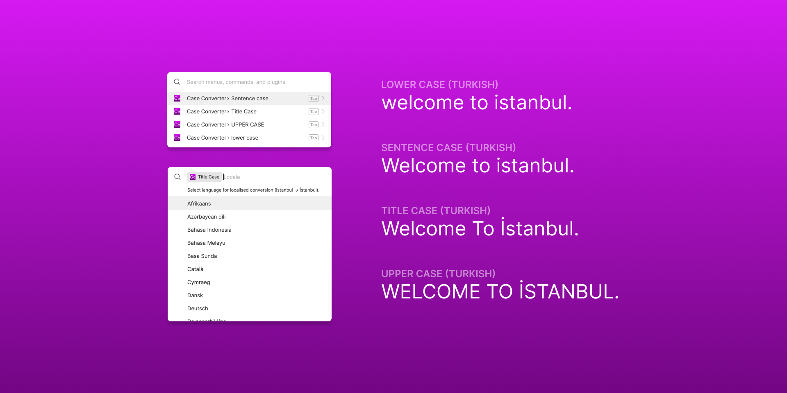

# Case Converter

Changes the case of text in selected nodes to `Sentence case`, `Title Case`, `UPPER CASE` or `lower case`. 

Supports locale conversion, which means, it converts `istanbul` to `İSTANBUL`, if `Turkish` language chosen.